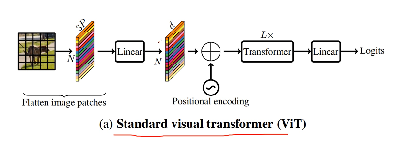
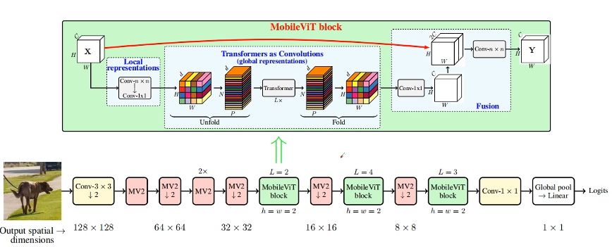
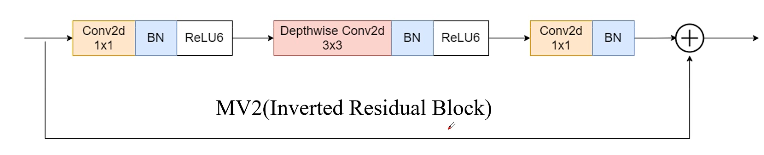
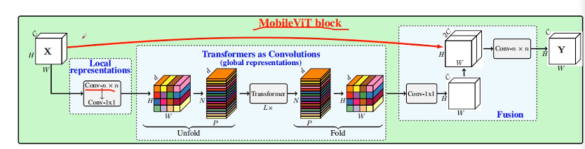
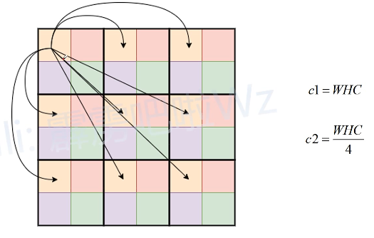
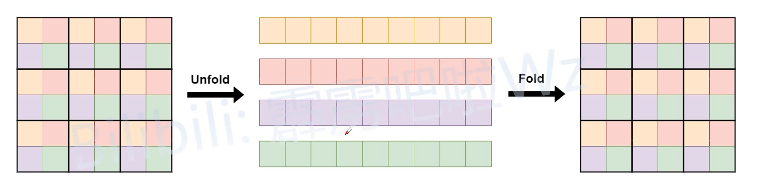

#Paper Note

##MobileViT
- 轻量级、通用
####目录
- 前言
- 模型结构
- 模型配置

1. 前言
transformer参数多，算力要求高
缺少空间归纳偏置（绝对位置偏置，位置序列根据原图大小的patch而生成。当输入图像尺寸不一样时，图像patch序列与位置编码序列长度不一致）
迁移繁琐
训练困难

2. 模型结构

- cls token并不是必须的
- 展平+线性投影可以用过卷积层实现

mobilevit模型结构：

- 主要包括卷积层+MV2块+mobilevit块+池化层+全连接层

MV2块结构:参考mobilenet

mobilevit块结构：

input: $X：H*W*C$
通过conv3×3 + conv1×1进行局部表征（学习低维特征表示）
通过Unfold + Transformer + Fold进行全局特征表示
- vit序列中每一个元素需要和剩下所有元素进行MSA计算
- mobilevit对feature map划分patch，对每个patch对应位置的元素计算MSA，减少计算量。但只是在MSA计算时减少计算量，在NORM，MLP中，仍旧是对整个序列长度进行处理。

- 图像数据中大部分特征都是冗余的。相邻像素的特征表示意义不会有太大差异。
- 通过将颜色相同的元素拉成一个序列,进入transformer块计算（全局建模）。再返回原来形状。

通过conv1×1进行还原，和input拼接融合，再经过一个conv3×3得到输出

3. 结构解析

- classification:patch大（8）效果好
- detection:patch差异变小
- segmentation：patch小有优势，对语义信息要求高

